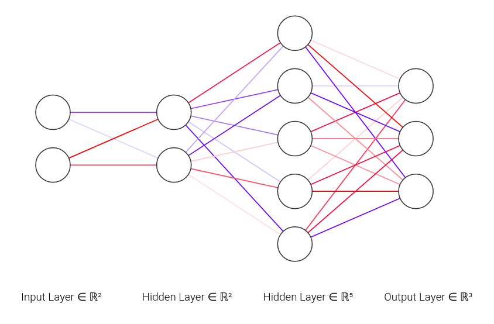
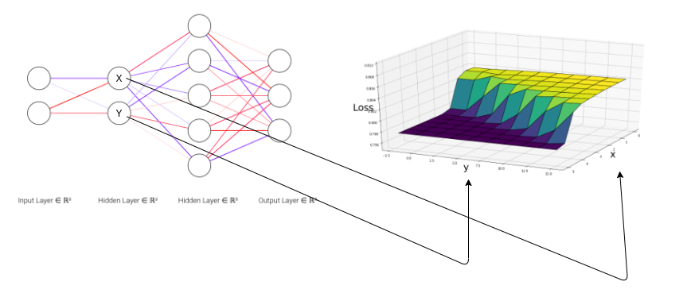
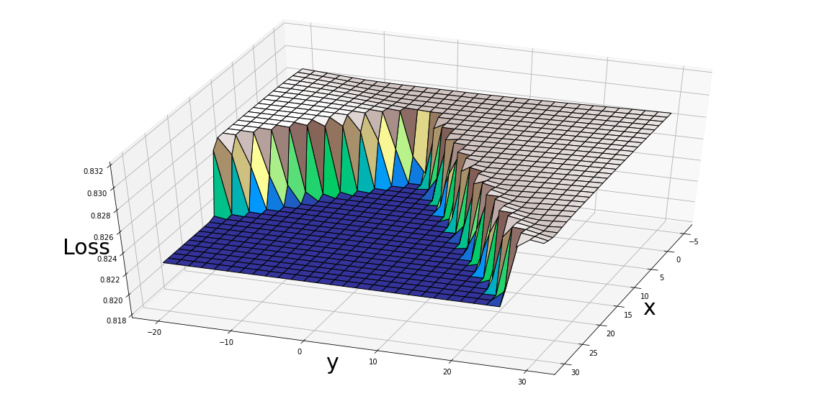
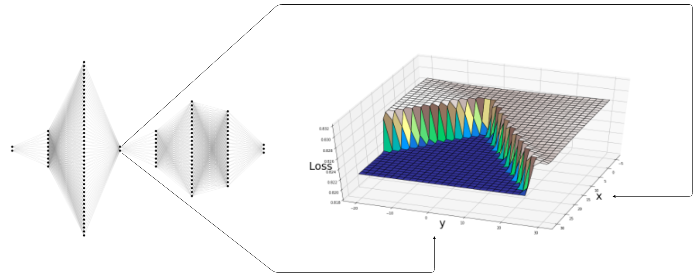
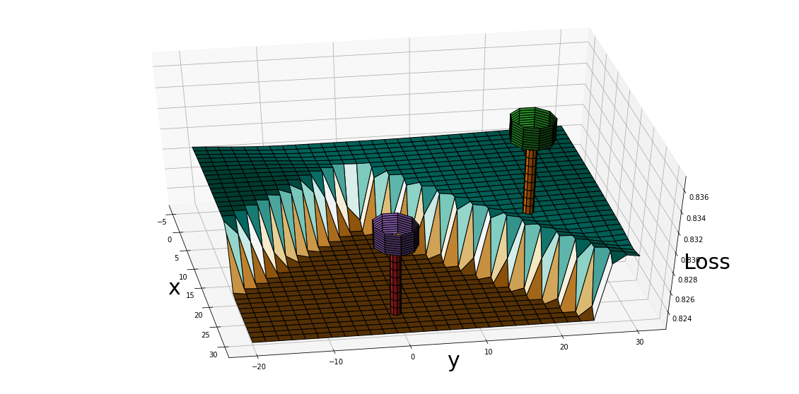

# loss_landscape
Visualizing the lower dimensional error space of various datasets on deep neural networks 

## The iris dataset
It is not necessary here to train a good model from the datase, the objective is to visualize the loss. So using a simple and shallow linear model would be good enough for the job. 

After training the model on the first 2 columns of the iris dataset, I plotted out the loss values with respect to the varying outputs in  hidden layer 2 (as shown below). Since this was done after the model was trained, we can ignore the subsequent layers and visualise the loss with respect to outputs from hidden layer 2. 

## Visualizing the landscape on a simple encoder decoder type architecture 

The bottleneck layer shown below with a size of 2 has to retain all the information from the encoder layer, but slight variations to this layer can cause major changes to the loss because of the higher dimensional layers after the bottleneck. 

### Life's too short to not draw trees on the loss landscape 

